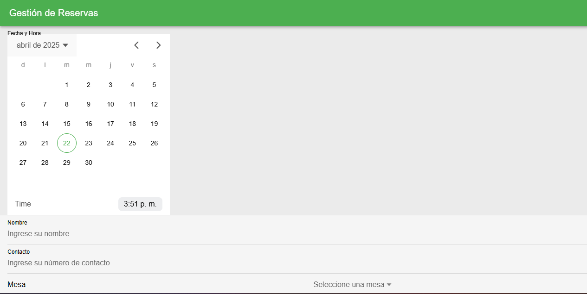
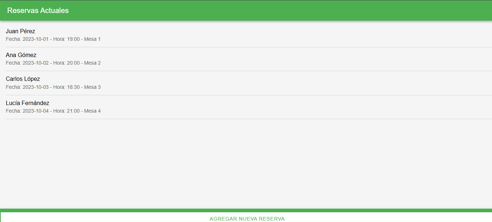

# Historia de Usuario - HU-04

## Pantalla Principal para Gestión de Reservas

### **Descripción:**
Como usuario del sistema, quiero acceder a una pantalla principal que integre los componentes de selección de fecha y hora, ingreso de datos del cliente y selección de mesa, de manera que pueda realizar una reserva completa desde un solo lugar.

---

## **Criterios de Aceptación:**

1. **Visualización de la Pantalla:**
   - La pantalla debe mostrar los componentes de selección de fecha y hora, ingreso de datos del cliente y selección de mesa.
   - Cada componente debe estar claramente identificado y organizado.

2. **Interacción:**
   - El usuario debe poder interactuar con cada componente de forma independiente.
   - Los datos ingresados en cada componente deben almacenarse correctamente.

3. **Validación:**
   - Todos los campos deben ser validados antes de confirmar la reserva.
   - Si algún campo está vacío o contiene datos no válidos, se debe mostrar un mensaje de error.

4. **Compatibilidad:**
   - La pantalla debe ser funcional en dispositivos móviles y de escritorio.




---

## **Definición de Hecho:**
- La pantalla principal está implementada y probada.
- Todos los componentes están integrados y funcionan correctamente.
- Los datos ingresados se almacenan y validan correctamente.

---

## **Diseño de la Pantalla:**

### **Archivo:** `GestionReservas.tsx`
```tsx

import React from 'react';
import { IonPage, IonHeader, IonToolbar, IonTitle, IonContent, IonButton } from '@ionic/react';
import SeleccionFechaHora from '../components/SeleccionFechaHora';
import IngresoDatosCliente from '../components/IngresoDatosCliente';
import SeleccionMesa from '../components/SeleccionMesa';

const GestionReservas: React.FC = () => {
  const handleConfirmReservation = () => {
    // Lógica para confirmar la reserva
    console.log('Reserva confirmada');
  };

  return (
    <IonPage>
      <IonHeader>
        <IonToolbar>
          <IonTitle>Gestión de Reservas</IonTitle>
        </IonToolbar>
      </IonHeader>
      <IonContent>
        <SeleccionFechaHora />
        <IngresoDatosCliente />
        <SeleccionMesa />
        <IonButton expand="full" onClick={handleConfirmReservation}>
          Confirmar Reserva
        </IonButton>
      </IonContent>
    </IonPage>
  );
};

export default GestionReservas;
```

---

## **Estilo de la Pantalla:**

### **Archivo:** `variables.css`
```css
:root {
  --ion-color-primary: #4caf50;
  --ion-color-secondary: #03a9f4;
}
```

---

## **Pruebas:**

1. **Prueba de Integración:**
   - Verificar que todos los componentes se muestren correctamente en la pantalla principal.

2. **Prueba de Interacción:**
   - Interactuar con cada componente y confirmar que los datos se almacenen correctamente.

3. **Prueba de Validación:**
   - Intentar confirmar una reserva con campos vacíos y verificar que se muestre un mensaje de error.

4. **Prueba de Compatibilidad:**
   - Verificar que la pantalla sea funcional en dispositivos móviles y de escritorio.